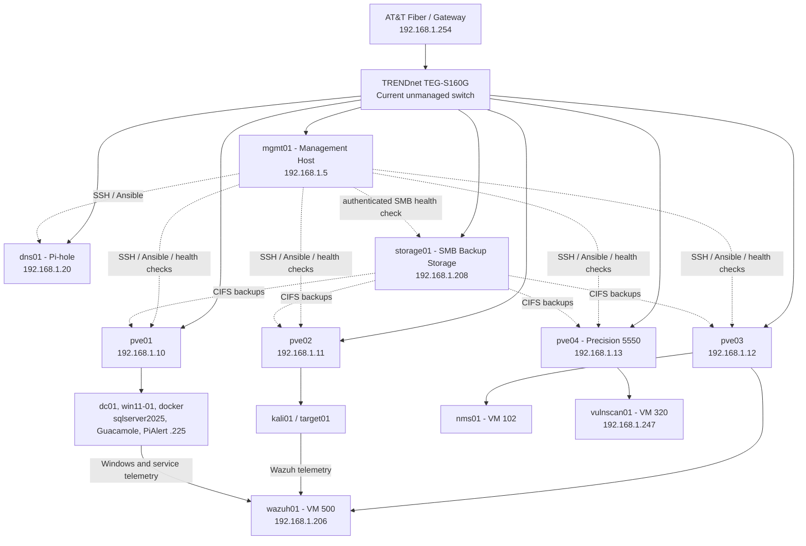

# Current Homelab Architecture

This diagram reflects the implemented lab after the `pve04` expansion and workload rebalancing. The Cisco SG350-10 has now been bench-configured as `sw01`, but the diagram continues to show the current live flat-network path until the physical homelab migration is completed and validated.

## Current State

- `pve01`, `pve02`, `pve03`, and `pve04` form the `homelab` Proxmox cluster.
- The four-node cluster requires three votes for quorum and was verified quorate.
- `pve04` is a Dell Precision 5550 using a Realtek USB Gigabit Ethernet adapter.
- `mgmt01` remains independent of the cluster and provides SSH/Ansible administration, service-health validation, and scheduled operational monitoring.
- `dns01` provides Pi-hole DNS at `192.168.1.20`.
- `storage01` provides shared `t-20-backup` CIFS storage.
- `nms01` and `wazuh01` run on `pve03`; `vulnscan01` runs on `pve04`.
- VM disks remain local to each node; backups provide recovery protection.
- This design does not claim Ceph, Proxmox HA, or automatic workload failover.
- `sw01` is a staged Cisco SG350-10 at `192.168.1.21/24`; firmware, default VLAN state, and a baseline configuration backup have been validated, but it is not yet shown as the current live switching path.

## Security and Identity Paths

| Source | Function | Destination |
|---|---|---|
| `win11-01` | Sysmon, PowerShell, and Windows Security telemetry | `wazuh01` |
| `dc01` | Active Directory security telemetry | `wazuh01` |
| `target01` | Linux, Apache, Auditd, and FIM telemetry | `wazuh01` |
| `kali01` | Controlled test activity | Lab-owned target systems |
| `vulnscan01` | Authorized vulnerability scanning | Lab-owned systems |

The `corp.home.arpa` Active Directory domain is operational. `dc01` provides AD
DS and AD-integrated DNS, and `win11-01` is domain joined with its secure channel
validated.

## Planned Network Phase

The current live switch path remains the 16-port unmanaged TRENDnet TEG-S160G. The Cisco SG350-10 has been received and staged as `sw01` with management address `192.168.1.21/24`. The initial port convention reserves Gi1-Gi4 for `pve01`-`pve04` and Gi8 for the upstream connection. Final port use, VLAN segmentation, additional Proxmox interfaces where required, and OPNsense routing will be documented only after the physical migration and VLAN work are implemented and validated. The TRENDnet remains the home-network switch rather than being replaced by `sw01`.

A separate future resilience test will use the existing GL.iNet GL-A1300 travel
router with a compatible USB LTE modem and SIM as a backup Internet connection.
Modem compatibility, cellular service, failover, recovery to the primary WAN, and
monitoring behavior must be tested before this is presented as operational.
