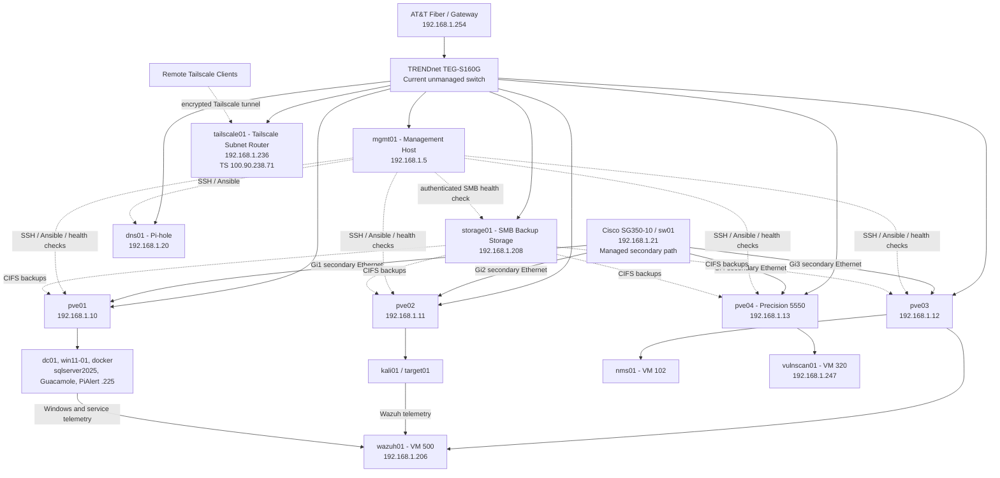

# Current Homelab Architecture

This diagram reflects the implemented lab after the `pve04` expansion, workload rebalancing, and initial Cisco managed-switch deployment. The existing flat management path remains on the TRENDnet switch, while the Proxmox nodes now also have secondary physical Ethernet paths to `sw01` for the upcoming VLAN phase.

## Current State

- `pve01`, `pve02`, `pve03`, and `pve04` form the `homelab` Proxmox cluster.
- The four-node cluster requires three votes for quorum and was verified quorate.
- `pve04` is a Dell Precision 5550 using a Realtek USB Gigabit Ethernet adapter.
- `mgmt01` remains independent of the cluster and provides SSH/Ansible administration, service-health validation, and scheduled operational monitoring.
- `dns01` provides Pi-hole DNS at `192.168.1.20`.

- `tailscale01` is a dedicated Raspberry Pi Tailscale subnet router at `192.168.1.236` with Tailscale address `100.90.238.71`; it advertises remote access to the `192.168.1.0/24` homelab subnet.
- `storage01` provides shared `t-20-backup` CIFS storage.
- `nms01` and `wazuh01` run on `pve03`; `vulnscan01` runs on `pve04`.
- VM disks remain local to each node; backups provide recovery protection.
- This design does not claim Ceph, Proxmox HA, or automatic workload failover.
- `sw01` is operational at `192.168.1.21/24` and is physically connected to the Proxmox secondary Ethernet paths on Gi1-Gi4. The existing `vmbr0` management path remains on `sw-home01`; VLAN segmentation is not yet operational.

## Security and Identity Paths

| Source | Function | Destination |
|---|---|---|
| `win11-01` | Sysmon, PowerShell, and Windows Security telemetry | `wazuh01` |
| `dc01` | Active Directory security telemetry | `wazuh01` |
| `target01` | Linux, Apache, Auditd, and FIM telemetry | `wazuh01` |
| `kali01` | Controlled test activity | Lab-owned target systems |
| `vulnscan01` | Authorized vulnerability scanning | Lab-owned systems |
| Remote Tailscale clients | Encrypted remote subnet access via `tailscale01` | `192.168.1.0/24` homelab LAN |

The `corp.home.arpa` Active Directory domain is operational. `dc01` provides AD
DS and AD-integrated DNS, and `win11-01` is domain joined with its secure channel
validated.

## Next Network Phase

The current Proxmox management path remains on the 16-port unmanaged TRENDnet TEG-S160G. The Cisco SG350-10 is now physically deployed as `sw01`, with Gi1-Gi4 connected to the secondary Ethernet paths of `pve01`-`pve04`. The next phase is to complete `vmbr1` and VLAN-aware configuration where required, define VLAN and trunk behavior, introduce OPNsense routing and policy enforcement, and validate segmentation before describing the VLAN design as operational. The TRENDnet remains the home-network switch rather than being replaced by `sw01`.

A separate future resilience test will use the existing GL.iNet GL-A1300 travel
router with a compatible USB LTE modem and SIM as a backup Internet connection.
Modem compatibility, cellular service, failover, recovery to the primary WAN, and
monitoring behavior must be tested before this is presented as operational.
