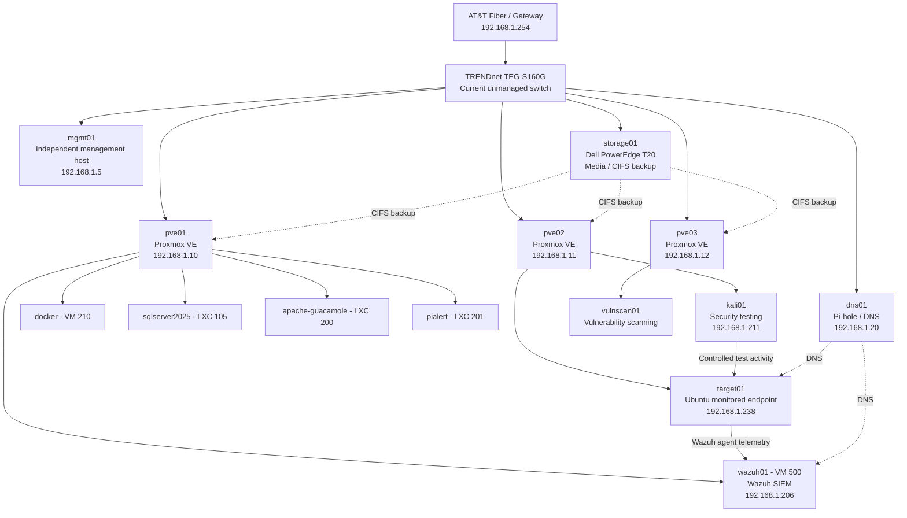

# Current Homelab Architecture

This diagram reflects the currently implemented lab before the planned Cisco managed-switch, VLAN, and OPNsense phase.



## Current State

- `pve01`, `pve02`, and `pve03` form the `homelab` Proxmox cluster.
- `mgmt01` remains independent of the cluster for administrative access.
- `dns01` provides DNS using Pi-hole.
- `storage01` provides media/storage services and shared Proxmox backup storage.
- `wazuh01` provides SIEM and endpoint monitoring.
- `target01` is the first actively monitored Linux endpoint.
- `kali01` is used for controlled security-testing activity against lab-owned targets.

## Planned Network Phase

The current unmanaged switch will later be supplemented/replaced in the lab design by a managed Cisco switch. VLAN segmentation and OPNsense will be documented only after those components are actually implemented.

---

## Windows Security Telemetry Expansion - August 2026

The current lab now also includes two Windows systems on `pve01`:

| System | Role | Current state |
|---|---|---|
| `dc01` | Windows Server / future Active Directory domain controller | Static `192.168.1.30`; AD DS role installed; not yet promoted |
| `win11-01` | Windows 11 Pro monitored endpoint | DHCP; `192.168.1.167` during validation; Wazuh agent, Sysmon and PowerShell Script Block Logging enabled |

Current Windows security-telemetry path:

```text
win11-01
   |
   +-- Sysmon Event ID 1
   +-- PowerShell Event ID 4104
   |
   v
Wazuh Agent
   |
   v
wazuh01
   |
   +-- Rule 92027 -> T1059.001 PowerShell
   +-- Rule 91843 -> T1059.001 PowerShell / T1112 Modify Registry
```

`dc01` and `win11-01` are currently staged for the Active Directory phase. `win11-01` remains standalone until `dc01` is promoted and AD DNS is configured.
