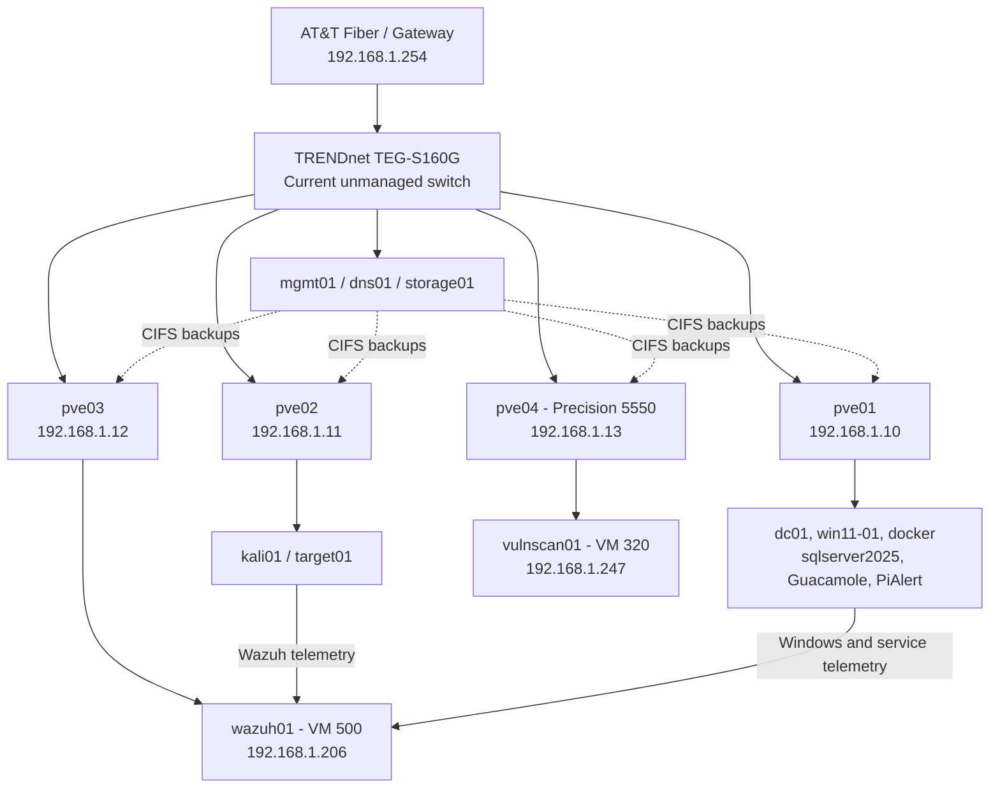

# Current Homelab Architecture

This diagram reflects the implemented lab after the `pve04` expansion and
workload rebalancing, but before the planned Cisco managed-switch, VLAN, and
OPNsense phase.

## Current State

- `pve01`, `pve02`, `pve03`, and `pve04` form the `homelab` Proxmox cluster.
- The four-node cluster requires three votes for quorum and was verified quorate.
- `pve04` is a Dell Precision 5550 using a Realtek USB Gigabit Ethernet adapter.
- `mgmt01` remains independent of the cluster for administrative access.
- `dns01` provides Pi-hole DNS at `192.168.1.20`.
- `storage01` provides shared `t-20-backup` CIFS storage.
- `wazuh01` runs on `pve03`; `vulnscan01` runs on `pve04`.
- VM disks remain local to each node; backups provide recovery protection.
- This design does not claim Ceph, Proxmox HA, or automatic workload failover.

## Security and Identity Paths

| Source | Function | Destination |
|---|---|---|
| `win11-01` | Sysmon, PowerShell, and Windows Security telemetry | `wazuh01` |
| `dc01` | Active Directory security telemetry | `wazuh01` |
| `target01` | Linux, Apache, Auditd, and FIM telemetry | `wazuh01` |
| `kali01` | Controlled test activity | Lab-owned target systems |
| `vulnscan01` | Authorized vulnerability scanning | Lab-owned systems |

The `corp.home.arpa` Active Directory domain is operational. `dc01` provides AD
DS and AD-integrated DNS, and `win11-01` is domain joined with its secure channel
validated.

## Planned Network Phase

The current unmanaged switch will later be supplemented or replaced in the lab
design by a managed Cisco switch. VLAN segmentation, a second `pve04` Ethernet
adapter, and OPNsense routing will be documented only after those components are
implemented and validated.
