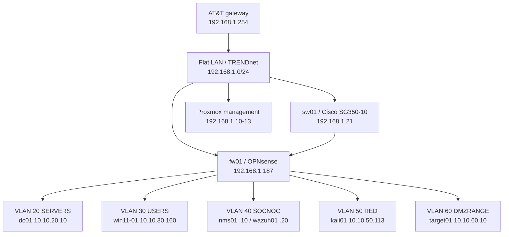

# Current Homelab Architecture

This diagram reflects the operational segmented lab as verified on 2026-09-11.

## Flat-LAN Services

| Asset | Address | Role |
|---|---:|---|
| `mgmt01` | `192.168.1.5` | Independent administration host |
| `dns01` | `192.168.1.20` | Pi-hole DNS |
| `apache-guacamole` | `192.168.1.151` | Browser remote access |
| `docker` | `192.168.1.174` | Uptime Kuma and ADS-B applications |
| `pialert` | `192.168.1.225` observed | Flat broadcast-domain discovery |
| `tailscale01` | `192.168.1.236` | Remote subnet access |
| `adsb01` | `192.168.1.246` | ADS-B receiver |
| `storage01` | `192.168.1.208` | SMB and Proxmox backup storage |

Proxmox guest disks remain local to their nodes and `t-20-backup` provides backup-based recovery. The lab does not claim Ceph, Proxmox HA, or automatic workload failover.

## Security Paths

| Source | Required destination and service |
|---|---|
| `dc01`, `win11-01`, `target01` | Wazuh manager `10.10.40.20:1514/tcp` |
| `kali01` | Explicitly authorized attack-lab targets |
| `nms01` | Approved ICMP/SNMP/service monitoring targets |
| `apache-guacamole` | Explicit SSH/RDP destinations through OPNsense |
| Uptime Kuma on `docker` | Approved service endpoints through OPNsense |

The legacy flat NIC on `wazuh01` remains temporarily during the dependency audit. It should be removed only after issue #1's monitoring, DNS, firewall, and remote-access dependencies have been remediated and validated.
