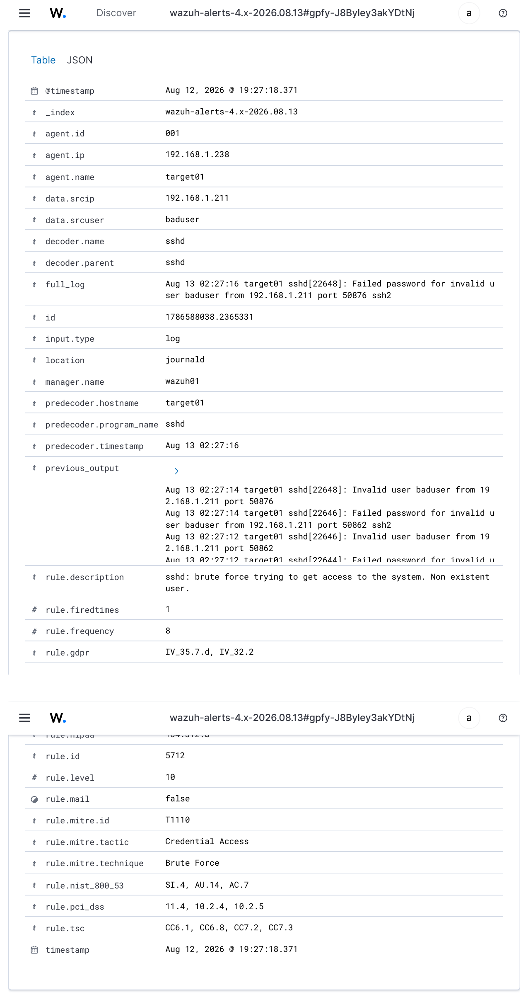
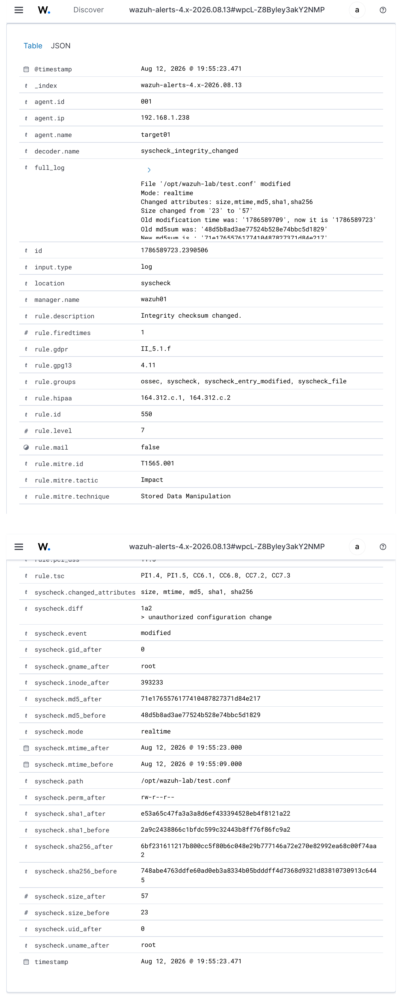
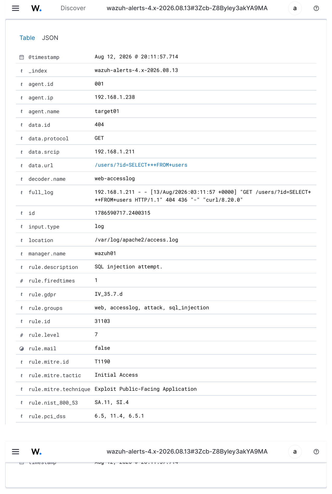
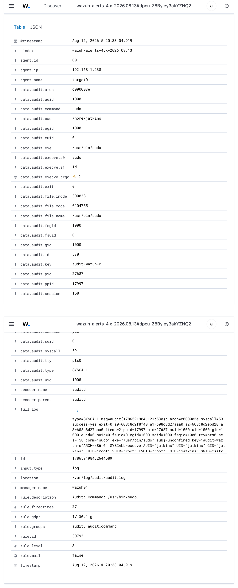
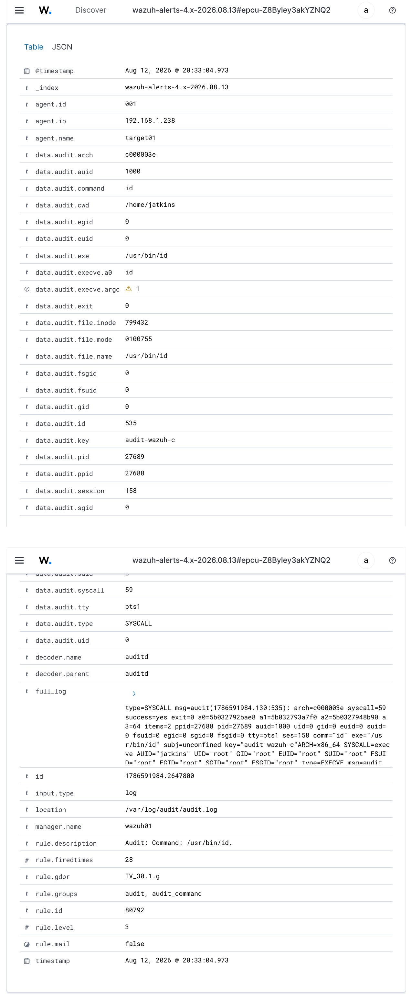
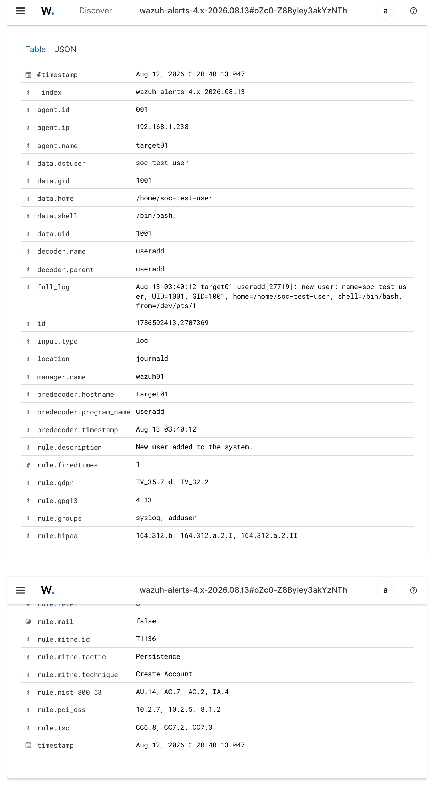
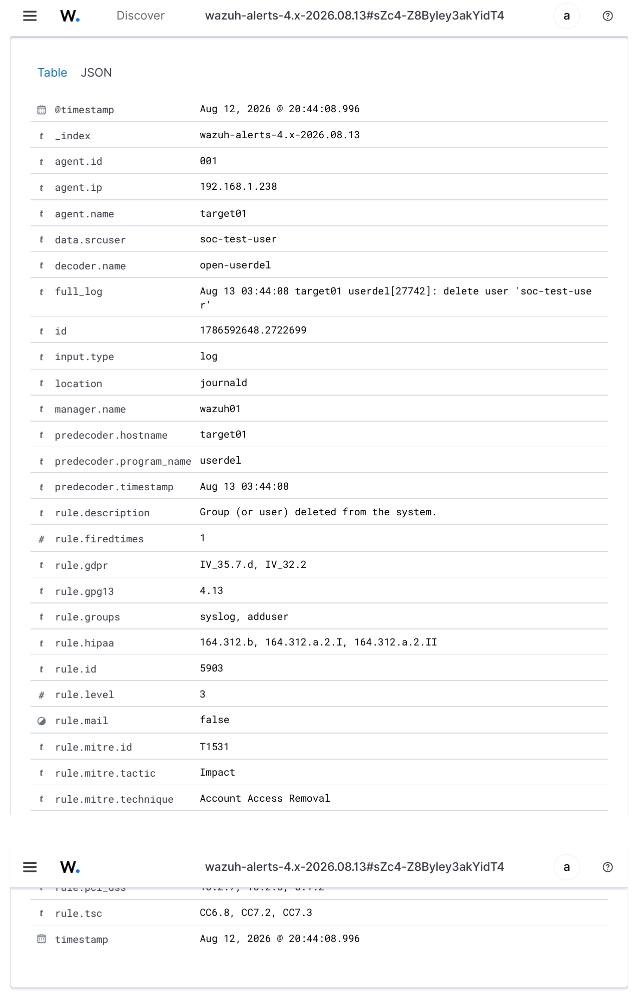
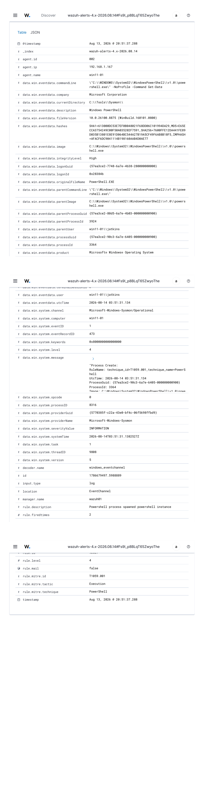
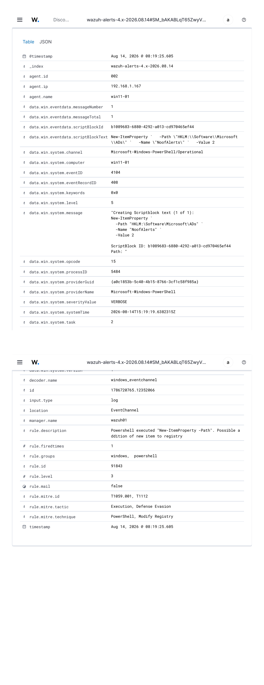

# Wazuh Attack Detection Labs

## Objective

After deploying Wazuh and enrolling `target01`, I used the lab to generate controlled security events and verify that endpoint telemetry could be collected, correlated, investigated, and mapped to security frameworks.

The purpose of these exercises was not simply to confirm that Wazuh was running. Each lab followed a basic SOC investigation workflow:

```text
Generate controlled activity
        ↓
Verify the event on the endpoint
        ↓
Collect telemetry with the Wazuh agent
        ↓
Correlate the event on wazuh01
        ↓
Review the resulting alert
        ↓
Identify source, target and behavior
        ↓
Evaluate rule severity and MITRE ATT&CK mapping
```

All activity was generated against systems in my own homelab.

## Lab Systems

| System | Role | IP Address |
|---|---|---|
| wazuh01 | Wazuh SIEM server | 192.168.1.206 |
| target01 | Ubuntu monitored endpoint | 192.168.1.238 |
| kali01 | Security testing system | 192.168.1.211 |

`target01` is enrolled in Wazuh as agent `001`.

---

# Lab 1 - SSH Brute-Force Detection

## Objective

Generate repeated failed SSH authentication attempts from `kali01` and determine whether Wazuh correlates the activity into a brute-force alert.

## Test Activity

From `kali01`, repeated SSH authentication attempts were generated against a nonexistent account on `target01`.

The test account name was:

```text
baduser
```

Eight controlled failed authentication attempts were generated in rapid succession.

## Endpoint Validation

The original SSH activity was independently verified on `target01` using:

```bash
sudo journalctl -u ssh --no-pager | grep '192.168.1.211'
```

Failed authentication events included:

```text
Failed password for invalid user baduser from 192.168.1.211
```

The controlled test generated eight failures in the correlation window.

Additional historical test activity from the same source meant that eleven total failed-password records were present in the journal, but the Wazuh correlation event specifically represented the group of eight new attempts.

## Wazuh Detection

Wazuh generated:

```text
Rule ID:       5712
Rule Level:    10
Description:   sshd: brute force trying to get access to the system.
               Non existent user.
```

The alert identified:

```text
Agent:         target01
Target IP:     192.168.1.238
Source IP:     192.168.1.211
Source user:   baduser
Frequency:     8
Decoder:       sshd
```

### Detection Evidence



## MITRE ATT&CK Mapping

```text
Technique:     T1110 - Brute Force
Tactic:        Credential Access
```

## Analyst Assessment

The event represented repeated authentication attempts against a nonexistent SSH account.

The endpoint logs independently confirmed the source IP, username and number of failures used by Wazuh to generate the correlated alert.

In a production environment, the next steps would include identifying the source host, reviewing other authentication attempts from the same address, determining whether any successful login followed the failures, and deciding whether containment was necessary.

## Skills Demonstrated

- SSH authentication log analysis
- Linux journald investigation
- Wazuh alert correlation
- Source IP identification
- Authentication failure analysis
- MITRE ATT&CK interpretation

---

# Lab 2 - File Integrity Monitoring

## Objective

Configure Wazuh File Integrity Monitoring to detect creation, modification and deletion of a monitored configuration file.

## FIM Configuration

A dedicated test directory was created on `target01`:

```bash
sudo mkdir -p /opt/wazuh-lab
```

The existing Wazuh `<syscheck>` configuration was updated to monitor the directory in real time:

```xml
<directories check_all="yes" realtime="yes" report_changes="yes">/opt/wazuh-lab</directories>
```

The Wazuh agent was restarted after the configuration change:

```bash
sudo systemctl restart wazuh-agent
sudo systemctl is-active wazuh-agent
```

## Test Activity

An initial file was created:

```bash
echo "original configuration" | sudo tee /opt/wazuh-lab/test.conf
```

The file was then modified:

```bash
echo "unauthorized configuration change" | \
sudo tee -a /opt/wazuh-lab/test.conf
```

The file was later deleted as part of the test.

## Wazuh Detection

The modification generated:

```text
Rule ID:       550
Rule Level:    7
Description:   Integrity checksum changed.
Event:         modified
Mode:          realtime
```

Wazuh recorded changes to:

```text
size
mtime
md5
sha1
sha256
```

The file size changed from 23 bytes to 57 bytes.

Because `report_changes="yes"` was enabled, Wazuh also captured the actual text added to the file:

```text
> unauthorized configuration change
```

The event retained both before and after cryptographic hashes.

### Detection Evidence



## MITRE ATT&CK Mapping

```text
Technique:     T1565.001 - Stored Data Manipulation
Tactic:        Impact
```

## Analyst Assessment

This demonstrated that Wazuh could detect not only that a monitored file changed, but also preserve useful forensic information about the modification.

The before/after hashes provide integrity evidence, while `syscheck.diff` can reveal the actual content change for supported text files.

In a production environment, this could be used to monitor sensitive configuration files, application settings, scripts or other files where unauthorized modification would require investigation.

## Skills Demonstrated

- Wazuh File Integrity Monitoring
- Real-time filesystem monitoring
- Hash-based integrity validation
- Configuration change detection
- File-change investigation

---

# Lab 3 - Web Attack / SQL Injection Detection

## Objective

Generate a suspicious HTTP request against Apache on `target01` and verify that Wazuh detects the request as an attempted SQL injection.

## Apache Log Collection

The Wazuh agent on `target01` was configured to collect the Apache access log:

```xml
<localfile>
  <log_format>apache</log_format>
  <location>/var/log/apache2/access.log</location>
</localfile>
```

The agent was restarted after the configuration change.

## Test Activity

From `kali01`, a controlled HTTP request containing SQL-like syntax was sent to Apache on `target01`:

```bash
curl -XGET "http://192.168.1.238/users/?id=SELECT+*+FROM+users"
```

The request did not require a vulnerable web application. The objective was to generate an access-log entry containing suspicious SQL injection syntax.

Apache returned HTTP 404 because the requested application path did not exist.

The request was still recorded in:

```text
/var/log/apache2/access.log
```

## Wazuh Detection

Wazuh decoded the request using:

```text
web-accesslog
```

and generated:

```text
Rule ID:       31103
Rule Level:    7
Description:   SQL injection attempt.
```

The alert included:

```text
Agent:         target01
Source IP:     192.168.1.211
Protocol:      GET
HTTP status:   404
```

The suspicious URL was preserved:

```text
/users/?id=SELECT+*+FROM+users
```

### Detection Evidence



## MITRE ATT&CK Mapping

```text
Technique:     T1190 - Exploit Public-Facing Application
Tactic:        Initial Access
```

## Analyst Assessment

The important result was not whether the web request succeeded.

Wazuh detected the attempted attack from the request recorded in the Apache access log.

This demonstrates the distinction between detecting malicious intent and confirming successful exploitation.

In a production investigation, an analyst would correlate this event with additional web requests, application logs, HTTP response codes, source reputation and endpoint activity to determine whether exploitation succeeded.

## Skills Demonstrated

- Apache access-log analysis
- Web attack detection
- SQL injection recognition
- HTTP event investigation
- Wazuh web-log decoding
- MITRE ATT&CK classification

---

# Lab 4 - Privileged Command Monitoring with Auditd

## Objective

Use Linux Audit and Wazuh to identify commands executed with root privileges while retaining the identity of the user who initiated them.

## Auditd Status

Auditd was verified on `target01`:

```bash
sudo auditctl -s
```

Auditing was enabled and no lost events were reported.

## Wazuh Audit Log Collection

The Wazuh agent was configured to collect:

```text
/var/log/audit/audit.log
```

using:

```xml
<localfile>
  <log_format>audit</log_format>
  <location>/var/log/audit/audit.log</location>
</localfile>
```

## Audit Rules

Two rules were loaded to monitor `execve` system calls where the effective UID is root:

```bash
echo '-a exit,always -F euid=0 -F arch=b64 -S execve -k audit-wazuh-c' | \
sudo tee -a /etc/audit/audit.rules
```

```bash
echo '-a exit,always -F euid=0 -F arch=b32 -S execve -k audit-wazuh-c' | \
sudo tee -a /etc/audit/audit.rules
```

The rules were loaded with:

```bash
sudo auditctl -R /etc/audit/audit.rules
```

and verified using:

```bash
sudo auditctl -l | grep audit-wazuh-c
```

## Test Activity

A controlled privileged command was executed:

```bash
sudo id
```

## Wazuh Detection

Wazuh generated rule:

```text
Rule ID:       80792
Rule Level:    3
Group:         audit_command
```

Two related events provided useful context.

The first recorded execution of `/usr/bin/sudo` with:

```text
AUID:          1000
EUID:          0
Command:       sudo
```

The audit record resolved the identities as:

```text
AUID="jatkins"
EUID="root"
```

The following event recorded the elevated command itself:

```text
Command:       id
Executable:    /usr/bin/id
UID:           0
EUID:          0
AUID:          1000
```

### Detection Evidence

`sudo` execution:



Elevated `id` execution:



## Why AUID and EUID Matter

The effective user ID showed that the command executed with root privileges:

```text
EUID=0
```

The Audit user ID continued to identify the original authenticated user:

```text
AUID=1000
```

This distinction makes it possible to answer two different questions:

```text
Who initiated the activity?
jatkins

What privilege level executed the command?
root
```

## Analyst Assessment

A log entry that simply says "root executed a command" may not be enough to determine accountability.

Linux Audit preserves the login identity across privilege escalation, allowing the analyst to attribute a root-level command back to the initiating user session.

This type of telemetry is useful when reviewing administrative activity, privilege escalation or potentially unauthorized command execution.

## Skills Demonstrated

- Linux Auditd administration
- Audit rule creation
- Linux UID/EUID/AUID interpretation
- Privileged command monitoring
- Wazuh Auditd integration
- User attribution after privilege escalation

---

# Lab 5 - Local Account Creation and Deletion

## Objective

Generate controlled Linux account-management activity and determine whether Wazuh detects account creation as potential persistence and account deletion as an access-removal event.

## Account Creation

A clearly identified lab account was created on `target01`:

```bash
sudo useradd -m -s /bin/bash soc-test-user
```

The account was verified with:

```bash
id soc-test-user
```

The new account received:

```text
UID:           1001
GID:           1001
Home:          /home/soc-test-user
Shell:         /bin/bash
```

## Wazuh Account-Creation Detection

Wazuh processed the native `useradd` event from journald.

The alert was:

```text
Rule ID:       5902
Rule Level:    8
Description:   New user added to the system.
Decoder:       useradd
```

### Detection Evidence



## MITRE ATT&CK Mapping

```text
Technique:     T1136 - Create Account
Tactic:        Persistence
```

## Analyst Assessment

Creation of a new local account can be legitimate administrative activity, but it can also represent an attempt to establish persistence.

A SOC analyst investigating this event would determine:

- Who created the account
- Whether the change was authorized
- What groups the account belongs to
- Whether the account received elevated privileges
- Whether the account subsequently authenticated
- Whether additional persistence mechanisms were added

## Account Deletion

The test account was removed after the creation event was validated:

```bash
sudo userdel -r soc-test-user
```

The deletion was verified by confirming that the account no longer existed.

## Wazuh Account-Deletion Detection

Wazuh generated:

```text
Rule ID:       5903
Rule Level:    3
Description:   Group (or user) deleted from the system.
Decoder:       open-userdel
```

The event identified:

```text
User:          soc-test-user
Agent:         target01
```

### Detection Evidence



## MITRE ATT&CK Mapping

```text
Technique:     T1531 - Account Access Removal
Tactic:        Impact
```

## Analyst Assessment

Account deletion can also require investigation.

An attacker or malicious administrator could remove accounts to disrupt access, interfere with recovery, or hide prior activity.

The combination of account-creation and account-deletion telemetry demonstrated that Wazuh was monitoring the full lifecycle of the controlled test account.

## Skills Demonstrated

- Linux account administration
- User creation/deletion monitoring
- Persistence detection
- Native Linux log analysis
- Wazuh account-management rules
- MITRE ATT&CK interpretation

---


---

# Lab 6 - Windows Sysmon PowerShell Process Detection

## Objective

Add Windows endpoint process telemetry to the lab and verify that Sysmon events from `win11-01` could be collected and correlated by Wazuh.

## Test Activity

Controlled PowerShell activity was generated on `win11-01`:

```powershell
powershell.exe -NoProfile -Command "Get-Date"
```

## Endpoint Validation

Sysmon recorded the activity in:

```text
Microsoft-Windows-Sysmon/Operational
```

as:

```text
Event ID: 1 - Process Create
```

The event contained process-analysis fields including the executable path, command line, parent process, user, integrity level, process identifiers, and executable hashes.

## Wazuh Detection

Wazuh received the Sysmon event from agent `win11-01` and generated:

```text
Rule ID:       92027
Rule Level:    4
Description:   Powershell process spawned powershell instance
```

The alert included the original command line:

```text
powershell.exe -NoProfile -Command Get-Date
```

## MITRE ATT&CK Mapping

```text
Technique:     T1059.001 - PowerShell
Tactic:        Execution
```

## Analyst Assessment

The exercise demonstrated the difference between merely knowing that PowerShell was used and having detailed process telemetry showing exactly which executable ran, how it was invoked, which account executed it, and what process spawned it.

In a production investigation, an analyst would compare the command line and parent/child relationship with the user's expected activity, review related network connections and file activity, and correlate the event with additional endpoint and authentication telemetry.

## Evidence



## Skills Demonstrated

- Windows endpoint monitoring
- Sysmon deployment and analysis
- Process-creation investigation
- Command-line analysis
- Parent/child process analysis
- Wazuh Windows event collection
- MITRE ATT&CK mapping
- SOC endpoint triage

---

# Lab 7 - PowerShell Script Block and Registry Modification Detection

## Objective

Enable PowerShell Script Block Logging on `win11-01`, collect Event ID `4104` with Wazuh, and validate a built-in detection for controlled registry modification through PowerShell.

## Telemetry Configuration

PowerShell Script Block Logging was enabled and verified with:

```powershell
Get-ItemProperty `
  "HKLM:\SOFTWARE\Policies\Microsoft\Windows\PowerShell\ScriptBlockLogging"
```

The policy returned:

```text
EnableScriptBlockLogging : 1
```

The Wazuh agent was configured to collect:

```text
Microsoft-Windows-PowerShell/Operational
```

using the `eventchannel` log format.

## Test Activity

A controlled registry value was created:

```powershell
New-ItemProperty `
  -Path "HKLM:\Software\Microsoft\ADs" `
  -Name "NoofAlerts" `
  -Value 2
```

## Endpoint Validation

Windows recorded the command in the PowerShell Operational log as:

```text
Event ID: 4104
Creating Scriptblock text
```

The event preserved the actual script block containing the `New-ItemProperty` command.

## Wazuh Detection

Wazuh generated:

```text
Rule ID:       91843
Rule Level:    3
Description:   Powershell executed "New-ItemProperty -Path".
               Possible addition of new item to registry
```

## MITRE ATT&CK Mapping

```text
T1059.001 - PowerShell
T1112     - Modify Registry

Tactics:
Execution
Defense Evasion
```

## Analyst Assessment

Registry modification through PowerShell may be legitimate administrative activity, but it can also be used for persistence, defense evasion, or configuration changes associated with malicious execution.

Script Block Logging is especially useful because it preserves the PowerShell content itself rather than only recording that a PowerShell process existed.

An analyst would review the user context, full script block, target registry path, surrounding process activity, and whether the modification was authorized.

## Cleanup

The controlled test value was removed after the alert was validated:

```powershell
Remove-ItemProperty `
  -Path "HKLM:\Software\Microsoft\ADs" `
  -Name "NoofAlerts"
```

## Evidence



## Skills Demonstrated

- PowerShell security logging
- Windows Event ID 4104 analysis
- Script Block Logging configuration
- Registry-change investigation
- Wazuh Windows event-channel collection
- MITRE ATT&CK mapping
- Endpoint telemetry validation
- SOC alert triage

# Detection Summary

| Lab | Detection | Rule | Level | MITRE |
|---|---|---:|---:|---|
| 1 | SSH brute force | 5712 | 10 | T1110 |
| 2 | File integrity modification | 550 | 7 | T1565.001 |
| 3 | SQL injection attempt | 31103 | 7 | T1190 |
| 4 | Root command execution | 80792 | 3 | - |
| 5a | Local account created | 5902 | 8 | T1136 |
| 5b | Local account deleted | 5903 | 3 | T1531 |
| 6 | Windows Sysmon PowerShell process | 92027 | 4 | T1059.001 |
| 7 | PowerShell registry modification | 91843 | 3 | T1059.001, T1112 |

## Telemetry Sources Used

The exercises used multiple Linux telemetry sources:

```text
SSH / journald
Apache access logs
Wazuh Syscheck / FIM
Linux Auditd
useradd / userdel journald events
Sysmon / Windows event channel
PowerShell Operational Event ID 4104
```

This was useful because the detections were not dependent on a single type of log.

## Investigation Workflow

Across the labs I repeatedly used the following approach:

1. Generate known test activity.
2. Verify the activity at the source or endpoint.
3. Locate the event in Wazuh.
4. Inspect the raw event.
5. Identify the source and destination.
6. Review the Wazuh rule and severity.
7. Review MITRE ATT&CK mappings where available.
8. Compare the SIEM alert against the original endpoint evidence.
9. Determine what additional investigation would be appropriate in a real environment.

## Current Result

The Wazuh lab has now demonstrated successful detection of:

- Authentication attacks
- File modification
- Web application attack attempts
- Privileged command execution
- Account creation
- Account deletion
- Windows Sysmon process creation
- PowerShell Script Block registry modification

The complete telemetry path has been validated:

```text
Security event
      ↓
target01
      ↓
Linux / application telemetry
      ↓
Wazuh agent
      ↓
wazuh01
      ↓
Rule correlation
      ↓
Threat Hunting
      ↓
Analyst investigation
```

## Lab Completion Checklist

- [x] SSH brute-force activity generated and detected
- [x] Raw SSH logs independently validated
- [x] File Integrity Monitoring configured and validated
- [x] File content change captured with `report_changes`
- [x] Apache access log collection configured
- [x] SQL-injection-style request detected
- [x] Auditd verified and integrated with Wazuh
- [x] Root command execution detected
- [x] AUID/EUID attribution validated
- [x] Local account creation detected
- [x] Local account deletion detected
- [x] Windows 11 endpoint enrolled in Wazuh
- [x] Sysmon installed and collected by Wazuh
- [x] Sysmon Event ID 1 / Rule 92027 validated
- [x] PowerShell Script Block Logging enabled
- [x] Event ID 4104 / Rule 91843 validated
- [x] MITRE ATT&CK mappings reviewed
- [x] Wazuh Threat Hunting used for event investigation

## Evidence Available

Evidence retained from the completed labs includes:

- Threat Hunting screenshots
- Wazuh event exports
- SSH journal output
- Apache access-log entries
- FIM event details and file diffs
- Auditd event details
- Account creation/deletion event exports
- Windows Sysmon / PowerShell alert exports

Public documentation should not include passwords, tokens or other sensitive credentials.

## Next Steps

Future detection exercises may include:

- SSH `authorized_keys` modification
- Additional persistence techniques
- Suspicious process execution
- Malware simulation using safe test artifacts
- Custom Wazuh rules
- Active Directory and domain-joined Windows telemetry
- Network-based detection
- Active Response testing
- Alert tuning and false-positive reduction

## Skills Demonstrated

- SIEM investigation
- Linux security monitoring
- Wazuh Threat Hunting
- Authentication analysis
- File Integrity Monitoring
- Web server log analysis
- Auditd analysis
- Privileged-user attribution
- Account-management monitoring
- MITRE ATT&CK mapping
- Event correlation
- SOC alert triage
- Evidence validation
- Security incident documentation
- Windows endpoint telemetry analysis
- Sysmon process analysis
- PowerShell Script Block Logging analysis
